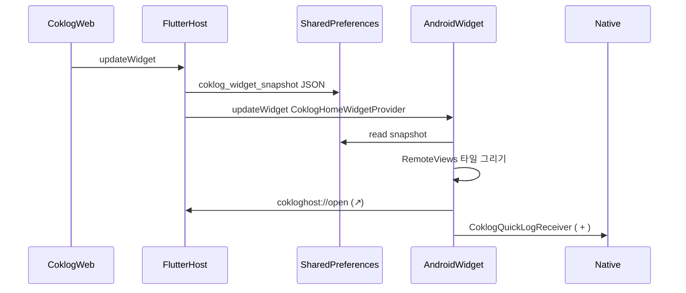

# Android 콕로그 홈 위젯

iOS `CoklogHomeWidget`과 **같은 스냅샷 JSON·클릭 URI**를 Android App Widget으로 그린다.  
Flutter Host(`CoklogLaunchService`, `snapshot_writer`)는 재사용한다.

관련: [위젯 런치](./coklog_launch_service.md) · [열기 트리거](./coklog_open_triggers.md) · [아키텍처](./coklog_architecture.md)

---

## 1. 한 줄

미니앱이 위젯을 저장하면 Host가 SharedPreferences에 JSON을 쓰고,  
`CoklogHomeWidgetProvider`가 그걸 읽어 홈 화면에 타일을 그린다.  
↗ 타일은 `cokloghost://open`으로 앱을 연다.  
+ 타일은 앱을 열지 않고 `CoklogQuickLogReceiver`가 iOS `BackgroundIntent`와 같이 네이티브 POST 한다.

Android에는 **App Group이 없다.** 앱과 위젯이 같은 UID라 `home_widget` SharedPreferences를 공유한다.  
`HomeWidget.setAppGroupId`는 iOS 전용이며 Android에서는 no-op이다.

---

## 2. 데이터 흐름



스냅샷 키: `coklog_widget_snapshot` (없으면 `flutter.coklog_widget_snapshot`).  
Dart writer: [`lib/service/coklog/snapshot_writer.dart`](../../lib/service/coklog/snapshot_writer.dart)  
`androidName: 'CoklogHomeWidgetProvider'` → 클래스 `com.lohasmeal.CoklogHomeWidgetProvider`.

---

## 3. 파일 구성

```
android/app/src/main/
  kotlin/com/lohasmeal/
    CoklogHomeWidgetProvider.kt     AppWidgetProvider 구현
    CoklogHomeWidget                Manifest에 등록된 위젯 클래스 (모듈 name과 동일)
    coklog/
      CoklogSnapshot.kt             JSON 모델
      CoklogCategories.kt           iOS 카탈로그 포트 (색·아이콘·opensInApp)
      CoklogHomeWidgetViews.kt      2×2 / 4×2 / 4×4 RemoteViews 조립
      CoklogWidgetIntents.kt        ↗ Activity / + Broadcast PendingIntent
      CoklogQuickLogReceiver.kt     + 타일 BroadcastReceiver
      CoklogNativeQuickLog.kt       iOS BackgroundIntent 포트 (큐·POST·낙관적 스냅샷)
  res/
    xml/coklog_home_widget_info.xml 크기·리사이즈 메타
    layout/coklog_widget_*.xml      루트·행·셀
    drawable/icon_*.xml             iOS SVG → vector
    drawable/coklog_cell_bg.xml     타일 배경
  AndroidManifest.xml               receiver + cokloghost scheme
```

연결:

| 항목 | 위치 |
|---|---|
| Widget receiver | `AndroidManifest` `.CoklogHomeWidgetProvider` |
| 클릭 scheme | `MainActivity` intent-filter `cokloghost` (샵 `lohasmeal`과 분리) |
| Proguard | `-keep class com.lohasmeal.CoklogHomeWidgetProvider` |
| 문자열 | `res/values/strings.xml` (`콕로그`, placeholder) |

Glance/Compose는 쓰지 않는다. 현재 Android는 Kotlin 1.8.22·Compose 미사용이라 **RemoteViews**로 레이아웃을 조립한다.

---

## 4. RemoteViews가 하는 일

홈 위젯은 앱 프로세스가 아니라 **런처 프로세스**에서 그려진다.  
앱은 View를 직접 붙이지 못하고, XML 레이아웃에 “텍스트/이미지/클릭을 이렇게 채워라”는 지시만 넘긴다. 그 지시가 `RemoteViews`다.

iOS SwiftUI(`CoklogHomeWidget.swift`)와 같은 타일 구조(색, 아이콘, +, ↗, 수치, 상대시각)를 옮기되, RemoteViews 제약 때문에 **픽셀 단위까지 동일하진 않다.**

---

## 5. 크기 → 레이아웃

iOS는 WidgetKit 3 family. Android는 **위젯 하나 + 리사이즈**.  
`AppWidgetManager` 옵션 폭/높이로 family를 고른다.

| family | 대략 | 레이아웃 (iOS와 동일 매트릭스) |
|---|---|---|
| SMALL | 2×2 | `squareLayout` |
| MEDIUM | 가로 ≥ 약 250dp | `landscapeLayout` (4×2) |
| LARGE | 가로·세로 모두 큼 | `largeLayout` (최대 4×4, 타일 16개) |

스냅샷 `size == landscape`이면 폭 정보가 없을 때 MEDIUM으로 폴백한다.

빈 스냅샷 / `saved != true`: placeholder `"미니앱에서 위젯을 설정하세요"`.

---

## 6. 타일 클릭

카탈로그 `opensInApp` (없으면 스냅샷 필드):

| | URI | 처리 |
|---|---|---|
| ↗ 열기 | `cokloghost://open?moduleId=&homeWidget=1&appGroup=` | `HomeWidgetLaunchIntent` → `openCoklogMiniapp(categoryId:)` |
| + 퀵로그 | `cokloghost://quickLog?moduleId=&homeWidget=1&appGroup=` | `CoklogQuickLogReceiver` → 네이티브 POST |

↗ 클릭은 `MainActivity`를 연다. 앱이 이미 떠 있으면 `HomeWidget.widgetClicked`, 콜드스타트면 `initiallyLaunchedFromHomeWidget`.  
이후는 [`coklog_launch_service.md`](./coklog_launch_service.md)와 같다. 샵 `DeeplinkService`는 `cokloghost`를 무시한다.

+ 클릭은 iOS 17+ `BackgroundIntent`와 같다. 앱 UI를 띄우지 않고:

1. 스냅샷을 낙관적으로 패치 (`방금`)
2. `coklog_widget_quick_actions`에 enqueue
3. bootstrap 토큰으로 records + recent-records POST
4. 성공하면 큐에서 제거

실패분은 다음 앱 기동 때 `drainNativeQuickActions`가 처리한다.  
`home_widget`의 `HomeWidgetBackgroundIntent`(Flutter isolate)는 쓰지 않는다. 워커가 Dart 완료 전에 끝나서 기록이 빠질 수 있다.

타일마다 **서로 다른 PendingIntent requestCode**를 쓴다. (`home_widget` 기본값은 requestCode 0이라 마지막 타일 URI가 모든 셀을 덮어썼다.)

---

## 7. iOS와 다른 점

| | iOS | Android |
|---|---|---|
| 공유 저장소 | App Group `group.com.lohasmeal.coklog` | `HomeWidgetPreferences` SharedPreferences |
| UI 런타임 | Widget Extension + SwiftUI | 런처 + RemoteViews |
| 크기 | 3 family 각각 | 1개 위젯 리사이즈 |
| 퀵로그 | iOS 17+ 백그라운드 Intent | `CoklogQuickLogReceiver` 네이티브 POST |
| 런치 전달 | AppDelegate MethodChannel | `HomeWidgetLaunchIntent` |

JSON 필드(`moduleId`, `title`, `colorHex`, `opensInApp`, `displayValue`, `relativeLabel`)와 scheme은 같다.

---

## 8. 확인할 것

- 미니앱에서 위젯 저장 → 홈 위젯 타일/수치 갱신
- ↗ 타일 → 미니앱 해당 카테고리
- + 타일 → 앱을 안 열고 기록 (타일 값이 `방금`으로 바뀜)
- 콜드스타트 / 앱이 이미 켜진 상태 모두 `CoklogLaunchService` 1.5초 중복 가드 (↗만)
- 스냅샷 없음 → placeholder
