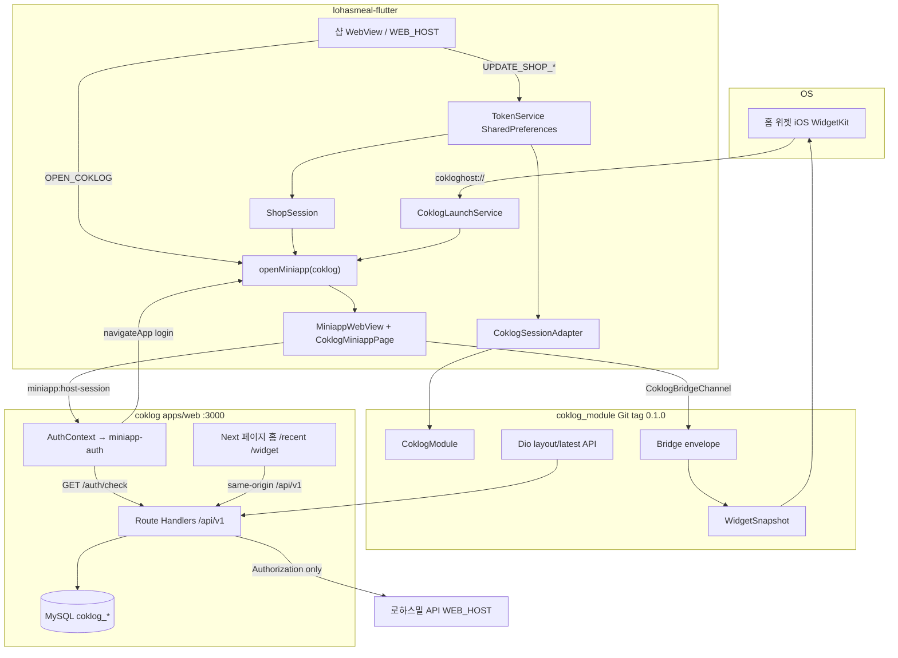
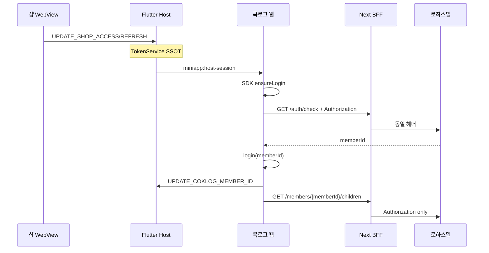
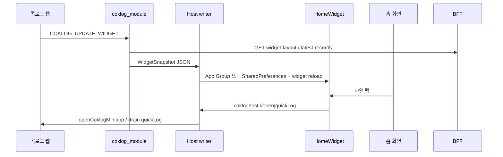

# 콕로그 3단 아키텍처

로하스밀 Flutter Host · `coklog_module` · coklog 웹(미니앱+BFF)이 어떻게 붙는지.  
샵 상품/결제 UI는 범위 밖. 로그인 폼은 **샵 WebView만**.

관련: [콕로그 Host 로직](./coklog_host_logic.md) · [미니앱 로그인 SDK](./miniapp_login_sdk.md) · [샵·브라우저 역할](./shop_and_coklog_responsibilities.md) · [Android 홈 위젯](./android_home_widget.md) · [Host vs Module 이전 결과](./host_vs_module.md)

---

## 1. 한눈에



---

## 2. 책임

| 레이어 | 하는 일 | 하지 않는 일 |
|---|---|---|
| **Host** (`lohasmeal-flutter`) | 샵 WebView, TokenService, `ShopSession`, `CoklogApp.initHost` 어댑터, **native 홈 위젯** (`android/`·`ios/`) | 콕로그 미니앱 WebView 셸, Bridge 처리 |
| **Module** (`coklog_module` ≥0.2) | Bridge, 스냅샷, quickLog, **미니앱 WebView 셸** (`CoklogMiniappPage`), launch/FCM refresh | 샵 토큰 SSOT, WidgetKit/AppWidget UI |
| **Web** (`coklog/apps/web`) | 기록/위젯 UI, `@lohasmeal/miniapp-auth`, BFF 프록시+캐시 | 소셜 로그인, 샵 화면 |

토큰 SSOT는 Host `TokenService` (`shopAccessToken` / `shopRefreshToken`).

---

## 3. Host (`lohasmeal-flutter`)

```
lib/service/coklog/host_binding.dart   Auth/Nav/Storage/Push/Platform → CoklogApp.initHost
lib/service/host/shop_session.dart     샵 토큰 refresh SSOT
ios/CoklogHomeWidget/                  WidgetKit (앱 폴더 유지)
android/.../CoklogHomeWidget*          RemoteViews (앱 폴더 유지)
```

| 진입 | 코드 |
|---|---|
| `/dev` | `CoklogApp.open()` |
| 샵 JS `OPEN_COKLOG` | `webview_ctl` → `CoklogApp.open` |
| 위젯 `cokloghost://` | 모듈 `CoklogLaunchService` |
| 샵 로그인 후 | `CoklogApp.resumeIfPending()` |

세션 없으면 샵 `WEB_HOST/login?redirectPath=/`.  
미니앱에 access+refresh 원문 주입 → 웹이 `/auth/check`.

env: `WEB_HOST`, `COKLOG_MINIAPP_URL`, `COKLOG_SERVER_BASE_URL`, `COKLOG_APP_GROUP_ID`.

---

## 4. Module (`coklog_module`)

pubspec: Git sandbox `coklog_api` `packages/coklog_module` ref **`0.2.0`** (개발 중 path `../coklog_module/packages/coklog_module` 가능).

Host가 `CoklogApp.initHost(auth:, navigation:, storage:, push:, platform:, config:)` 호출.
모듈이 미니앱 WebView 셸·Bridge·위젯 Dart·launch/FCM refresh를 소유한다.

- `accessToken` getter ← Host Auth (`TokenService`)
- `memberId` / `childId` ← Host Auth (store keys)
- `serverBaseUrl` ← `COKLOG_SERVER_BASE_URL`
- `snapshotWriter` ← App Group JSON
- `onNavigateApp` ← `login`이면 샵 로그인
- Dio는 **Authorization**만 (레이아웃 등). 일반 기록 API는 웹 BFF가 처리

미니앱 `CoklogBridge.postMessage` → 모듈 `CoklogBridgeChannel` → `handleBridgeEnvelope`.

Native 홈 위젯 UI는 Host `android/`·`ios/`에 잔존.
---

## 5. Web (`coklog`)

```
apps/web
  src/context/AuthContext.tsx     createMiniappAuth({ appId: 'coklog' })
  src/lib/api/client.ts           40199 재발급, 그 외 401 → Host 로그인
  src/app/api/v1/**               BFF
packages/bridge                   navigateApp / updateWidget 타입
```

브라우저 요청은 전부 same-origin `/api/v1`.

BFF:

- 로하스밀로 넘김: `Authorization: Bearer {access}` 만 (check, children, records)
- `POST /auth/access-token`만 `shopRefreshToken`
- 레이아웃·권장량 등 일부는 `coklog_*` DB만

`POST /auth/login` 프록시 없음. 로그인은 샵.

---

## 6. 인증 시퀀스



만료: 본문 `code === "40199"` → `POST /auth/access-token` 1회.  
그 외 HTTP 401 → Host가 샵 `/login`.

---

## 7. 위젯 시퀀스



iOS는 WidgetKit + App Group, Android는 `CoklogHomeWidgetProvider` + `home_widget` SharedPreferences. 클릭 URI와 Flutter Host(`CoklogLaunchService`)는 같다.

---

## 8. 네트워크 경계

| 호출 | from → to |
|---|---|
| 샵 페이지 | Host WebView → `WEB_HOST` |
| 미니앱 UI | 미니앱 WebView → `COKLOG_MINIAPP_URL` (same-origin BFF) |
| BFF 프록시 | Next → `LOHASMEAL_API_BASE_URL` (= 보통 `WEB_HOST`) |
| Module Dio | Host 프로세스 → `COKLOG_SERVER_BASE_URL` |
| 토큰 재발급 (Host) | Dart HttpClient → `WEB_HOST/api/v1/auth/access-token` |
| 위젯 네이티브 POST | Extension/Intent → `COKLOG_SERVER_BASE_URL` (`records/*`만; recent 캐시는 BFF가 기록 POST 시 갱신) |

**Host는 `/api/v1`을 우회하지 않는다.** 미니앱 `fetch`·모듈 `Dio`·위젯 HTTP는 모두 coklog BFF를 본다. 샵 API(`auth/check`, `children`, `records`)는 BFF가 `LOHASMEAL_API_BASE_URL`로 프록시한다.

개발: 미니앱·BFF `coklog-dev.mobidoc.us`, 샵 `lohasmeal-dev.mobidoc.us` (`--dart-define=env=.env.dev`).
