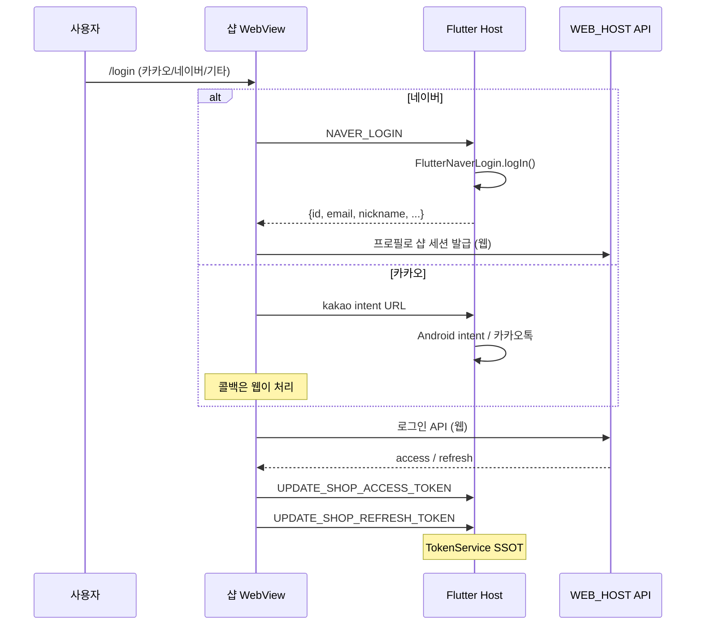
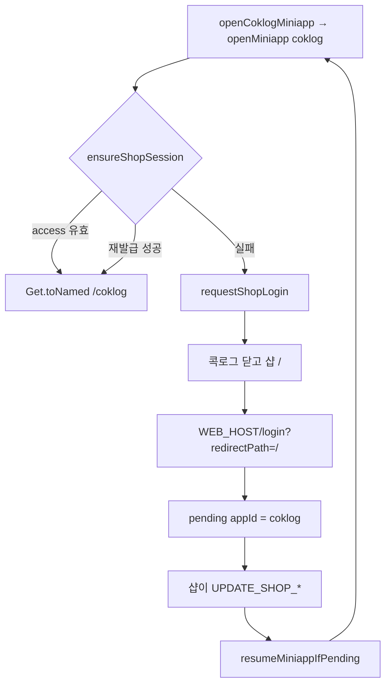

# 로그인 로직 (현재 상태)

Flutter Host에는 **로그인 화면이 없다.**  
회원 인증 UI·비밀번호·소셜 버튼은 전부 샵 웹(`WEB_HOST`)이 그리고, Host는 토큰 보관·소셜 SDK 브릿지·만료 시 샵 `/login` 이동만 한다.

관련: [콕로그 Host 로직](./coklog_host_logic.md) · [콕로그 아키텍처](./coklog_architecture.md) · [샵·브라우저 SSO](./shop_and_coklog_responsibilities.md) · [미니앱 로그인 SDK](./miniapp_login_sdk.md)

---

## 1. 한 줄

**샵 웹이 로그인하고, Host `TokenService`가 토큰을 들고, 콕로그는 그 토큰을 재사용한다.**

```
샵 WebView (WEB_HOST/login)
        │  UPDATE_SHOP_ACCESS_TOKEN
        │  UPDATE_SHOP_REFRESH_TOKEN
        ▼
TokenService  (SharedPreferences)
  shopAccessToken / shopRefreshToken     ← SSOT
        │
        ├─ 샵 웹 GET_SHOP_* 로 다시 읽음
        └─ MiniappWebView  miniapp:host-session
           콕로그 페이지는 coklog:host-session 도 발사
```

---

## 2. Host가 하는 일 / 안 하는 일

| Host가 함 | Host가 안 함 |
|---|---|
| 샵 토큰 SharedPreferences 저장 | 로그인 폼, 이메일/비번 검증 |
| 네이버 SDK 로그인 (`NAVER_LOGIN`) | Apple 로그인 |
| 카카오톡 **intent URL** 가로채기 | 카카오 SDK 로그인 (카카오 버튼 UI는 웹) |
| access 만료 시 `POST /api/v1/auth/access-token` | `POST /auth/login` 호출 |
| 세션 없으면 샵 `/login?redirectPath=/` 열기 | 콕로그 전용 계정 |

`lib/api/http_instance.dart`의 `jwtToken` 키는 **로그인 경로에서 쓰이지 않는다.** 실제 키는 `shopAccessToken` / `shopRefreshToken`이다.

---

## 3. 저장 키

`Store` = SharedPreferences 래퍼 (`lib/utils/store.dart`).

| 키 | 누가 씀 | 의미 |
|---|---|---|
| `shopAccessToken` | 샵 웹 → `TokenService` | JWT. 저장 시 `Bearer ` 접두어는 떼고 원문만 |
| `shopRefreshToken` | 샵 웹 → `TokenService` | 재발급용. access와 같으면 재발급에 안 씀 |
| `coklogMemberId` | 콕로그 미니앱 check 이후 | 샵 memberId 캐시 |
| `coklogChildId` | 콕로그 미니앱 | 선택된 아이 |

빈 문자열 / `null` / `undefined` / 빈 Map이면 해당 키를 **삭제**한다 (`TokenService._asToken`).

액세스 비우면 (`UPDATE_SHOP_ACCESS_TOKEN`이 빈 값) 샵 WebView 쪽에서 `coklogMemberId` / `coklogChildId`도 지운다.

---

## 4. 샵 로그인 (메인 경로)

부팅 후 메인 화면은 샵 InAppWebView (`/`, URL = `WEB_HOST`).  
로그인 성공·실패·세션 유지는 **웹이 결정**하고, 웹이 Host에 토큰을 밀어 넣는다.



### 4.1 웹 → Host 핸들러 (샵 WebView)

`lib/widget/page/index/webview_ctl.dart`

| Handler | 동작 |
|---|---|
| `GET_SHOP_ACCESS_TOKEN` | 저장된 access 반환 |
| `GET_SHOP_REFRESH_TOKEN` | 저장된 refresh 반환 |
| `UPDATE_SHOP_ACCESS_TOKEN` | 저장. 빈 값이면 콕로그 identity 삭제. 이어서 `resumeCoklogIfPending()` |
| `UPDATE_SHOP_REFRESH_TOKEN` | 저장. 이어서 `resumeCoklogIfPending()` |
| `NAVER_LOGIN` | 네이버 SDK → 계정 JSON |
| `NAVER_LOGOUT` | `FlutterNaverLogin.logOut()` (샵 토큰은 안 지움) |
| `LOAD_COMPLETED` | 웹 로드 후 `resumeCoklogIfPending()` |

### 4.2 네이버

- 파일: `lib/service/social_login_service.dart`
- 패키지: `packages/flutter_naver_login-master`
- Host는 **네이버 access token을 샵 토큰으로 쓰지 않는다.** 프로필만 웹에 넘긴다.
- 반환: `id`, `name`, `nickname`, `email`, `mobile`, `gender`, `age`, `birthday`

### 4.3 카카오

카카오 로그인 SDK 연동이 아니다.  
WebView가 `intent://…com.kakao.talk.intent` 를 열면 `shouldOverrideUrlLoading`이 가로채고, Android `nativeService.callAndroid("intent", …)`로 카카오톡을 띄운다. 앱이 없으면 fallback URL을 다시 로드한다.

iOS `LSApplicationQueriesSchemes`에 `kakaotalk`, `naversearchthirdlogin`이 있다.

### 4.4 Host가 샵 로그인을 직접 열 때

`WebviewCtl.openLoginPage()`:

1. WebView URL을 `WEB_HOST/login?redirectPath=/` 로 로드
2. 웹 라우터에도 `JS_NAVIGATE_TO` `/login?redirectPath=/`

호출하는 곳: `requestShopLogin()` ([`entry.dart`](../../lib/service/coklog/entry.dart) 래퍼) → [`requestMiniappShopLogin`](../../lib/service/host/miniapp_entry.dart).

---

## 5. 세션 유효 / 재발급

`ShopSession.ensureShopSession()` ([`lib/service/host/shop_session.dart`](../../lib/service/host/shop_session.dart)).  
콕로그 `CoklogSessionAdapter`는 이걸 위임하고, `coklogMemberId` / 위젯 Module만 가진다.

1. access가 있고 JWT `exp`가 아직이면 **통과** (skew 30초)
2. 아니면 refresh로 재발급
3. 그래도 없으면 **세션 없음** → 샵 로그인

재발급:

```
POST {WEB_HOST}/api/v1/auth/access-token
Header:
  shopRefreshToken: Bearer {refresh}
  Authorization:    Bearer {access}   (access가 있을 때만)
Body: {}
```

성공 시 응답 `data.accessToken` (또는 `access_token`)을 `TokenService`에 저장.  
HTTP 실패 / `code == 40199` / refresh가 비었거나 access와 같으면 실패.

`exp`가 없는 JWT는 만료로 보지 않는다 (파싱 실패도 만료 아님).

`memberId`는 미니앱이 쓰기 전이면 access JWT payload의 `memberId` / `member_id`를 읽는다.

---

## 6. 콕로그가 샵 로그인을 타는 경로

콕로그 전용 로그인은 없다. 미니앱은 샵 토큰을 받아서 `GET /auth/check`로 member를 확정한다.



진입:

| 진입 | 동작 |
|---|---|
| 샵 JS `OPEN_COKLOG` | `openCoklogMiniapp()` — **인자 없음**, 미니앱 홈 |
| `/dev` Click 1 | 동일 |
| 위젯 `cokloghost://open` | `openCoklogMiniapp(categoryId: moduleId)` |
| 미니앱 `navigateApp(login)` | `requestShopLogin` |
| 미니앱에서 세션 없음 | `openCoklogMiniapp` → 결국 샵 로그인 |

미니앱 로드 시:

1. 공통 셸: `__miniappPendingHostSession` + `miniapp:host-session`  
   `{ accessToken, refreshToken, memberId }` 원문 (Bearer 없음)
2. 콕로그 페이지가 같은 페이로드로 `coklog:host-session`도 발사 (호환)
3. `@lohasmeal/miniapp-auth` `ensureLogin` → BFF `GET /auth/check`
4. 콕로그 `onMember` → `UPDATE_COKLOG_MEMBER_ID` (및 child)

미니앱 Bridge `refreshSession` / `updateWidget` 직전에 다시 `ensureShopSession()`. 실패하면 `UNAUTHORIZED` + 샵 로그인.

---

## 7. 로그아웃 / 계정 전환

| 동작 | 코드 | 결과 |
|---|---|---|
| 샵 웹이 access를 빈 값으로 업데이트 | `UPDATE_SHOP_ACCESS_TOKEN` | access 삭제 + 콕로그 identity 삭제 |
| `/dev` Click 2 | `switchShopAccount()` | access/refresh + identity + **WebView 쿠키 전부** 삭제 후 샵 `/login` |
| `NAVER_LOGOUT` | 네이버 SDK만 logout | 샵 토큰은 그대로 |

Host 자체 로그아웃 화면은 없다. 샵 웹 로그아웃이 `UPDATE_SHOP_*`를 비우는 전제다.

---

## 8. 파일 맵

| 파일 | 역할 |
|---|---|
| `lib/service/token_service.dart` | 샵 토큰 CRUD, Bearer 제거, 빈 값 삭제 |
| `lib/service/host/shop_session.dart` | JWT 만료, 재발급, `ensureShopSession` |
| `lib/service/host/miniapp_entry.dart` | `openMiniapp(appId)`, pending 복귀 |
| `lib/service/host/miniapp_spec.dart` | 미니앱 URL·라우트 레지스트리 |
| `lib/widget/miniapp/miniapp_web_view.dart` | `miniapp:host-session`, `GET/UPDATE_SHOP_*` |
| `lib/service/social_login_service.dart` | 네이버 SDK / 카카오 intent |
| `lib/widget/page/index/webview_ctl.dart` | 샵 브릿지, 로그인 페이지 열기, 카카오 URL |
| `lib/service/coklog/session_adapter.dart` | memberId/childId, Module config |
| `lib/service/coklog/snapshot_writer.dart` | App Group 위젯 스냅샷 (세션과 분리) |
| `lib/service/coklog/entry.dart` | `openCoklogMiniapp` → `openMiniapp('coklog')` |
| `lib/widget/coklog/miniapp_page.dart` | 콕로그 Bridge·위젯·`coklog:host-session` |
| `lib/widget/page/dev/dev_ctl.dart` | 열기 / 강제 로그아웃 테스트 |

---

## 9. 지금 구조의 함의

- **계정 하나**: 샵 로그인 = 콕로그 로그인. 별도 콕로그 계정이 없다.
- **토큰 원문은 Host만 장기 보관.** 웹은 브릿지로 읽거나, 미니앱은 주입받아 메모리에 둔다.
- **재발급은 두 곳**이 같은 API를 칠 수 있다. Host Dart(`ensureShopSession`)와 콕로그 웹 BFF(`40199` → `/auth/access-token`). 결과는 다시 Host `TokenService`에 맞춰야 한다.
- 샵 WebView와 콕로그 WebView는 **쿠키를 공유하지 않아도** 된다. 인앱 세션은 SharedPreferences 토큰이다. `switchShopAccount`만 쿠키까지 지운다.
- **브라우저로 콕로그 URL 직접 접속**은 Host `TokenService`가 없다. 샵 로그인으로 **페이지 이동** 후 A(부모 도메인 쿠키) 또는 B(1회용 code)로 세션을 만든다. [요구사항 §4](./shop_web_coklog_open_requirements.md)
- 미니앱 웹은 [`@lohasmeal/miniapp-auth`](./miniapp_login_sdk.md) (`git+…#v0.1.0`)로 Host 세션을 받는다. 로그인 폼은 SDK에 없다.
